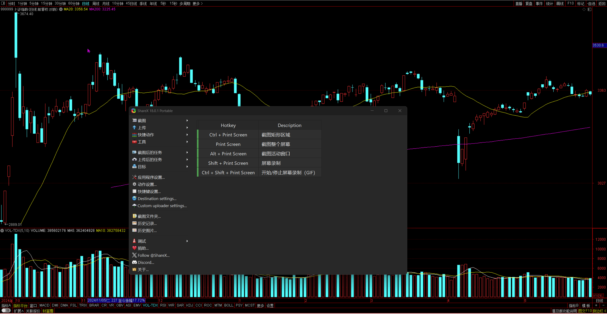

# 短线选股
**WR&RR一般都不低**

CO在大盘下跌的时候，市场情绪恐慌的时候，大家普遍规避风险的时候，这支股票肯定也受到影响。在这样的状况下，这支股票还在上涨，说明：
 - 供应虽然很多，但是需求更多
 - 庄家之前的吸筹并不充分，或者说长线交易者一直在买进

选取的方法：
1. 跟踪大盘下跌过程中一直在涨的个股，当他们回调的时候开始关注。
2. 个股在回调的时候幅度比较少，调整的幅度最好1/3~1/2左右，越小越好，不要超过1/2。
3. 如果同时有长期和短期的RS跳板更好；RS跳板以为这高概率的交易机会。
     - RS (Relative Strength) - 相对强度
     - 价格跳板：
        - HH和HL都在增加
        - D增加，S减少

# 一般选股
选股之前先要选板块，选板块之前先要看大盘位置和趋势，特别是大盘趋势的长中短期。
## 选择板块
选择大盘，在一个盘整区间选取行情统计

通过上面的形式找到一个盘整区间，统计该区间内的股票。

    tips：
    1. 盘整区间：指的是股票价格在一个时间段内保持在一个价格范围，不出现大的价格波动。
    2. 统计该区间内的板块指数。
        - 不是直接用板块排名。
        - 使用行业板块而不是其它类型板块特指概念板块。
    3. 上涨幅度/下跌幅度的比值，越大越好。
## 过滤板块
过滤板块的方法就是运用之前看个股的知识来识别板块指数的强弱，比如看板块指数的趋势；看板块指数的留白、削弱；看板块指数的上涨空间等。

## 选择个股
板块中涨幅大于指数的股票，涨跌比超过板块指数。

## 过滤个股
过滤的方法同之前：

    - 加上对关键K线的识别和分析
    - 加上对RS跳板的识别和分析

# 总结
一定要结合长期走势来判断，中期走势自然是选择后都不错的，短期倒不是那么重要，所以说**不见得**是*涨幅最高的*就是选择的标的。